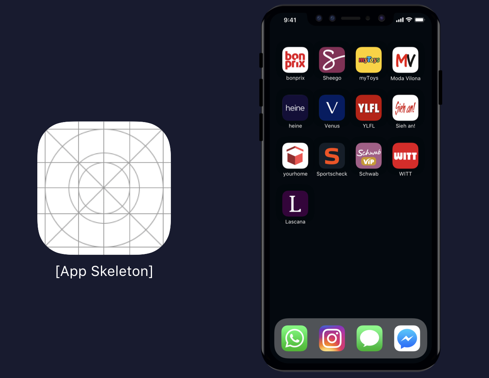
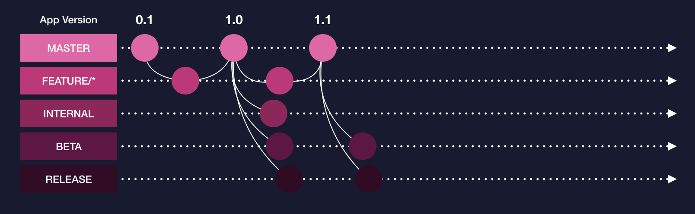
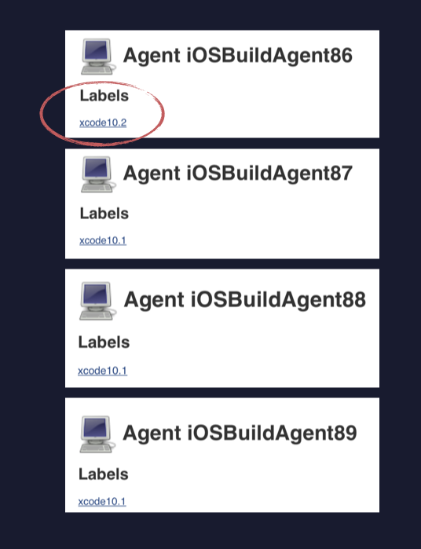
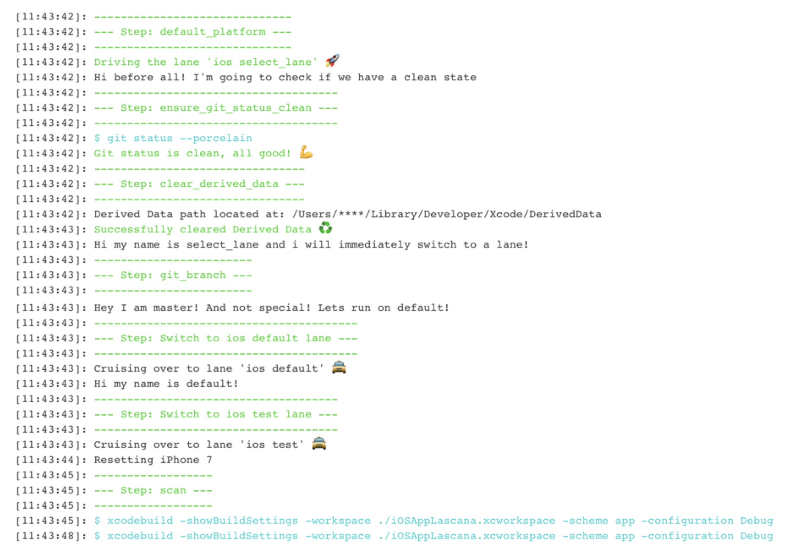
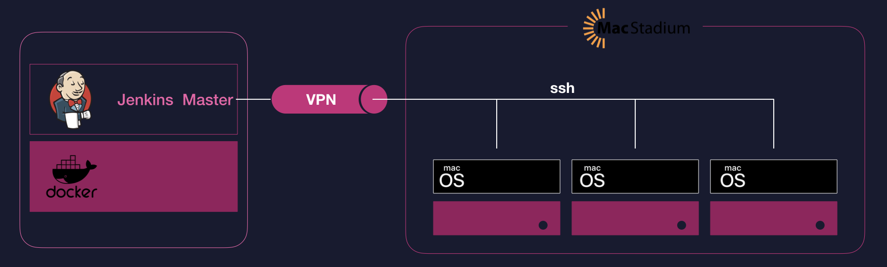

build-lists: true
# _**iOS Build that**_  scales
---
# me __*in emojis*__

<!--  -->

__*tobias hutzler*__
__*engineering lead @ otto group*__
🌱🏃🏊🚴🐶🚐🏄
____

# Agenda
[.list: alignment(left)]
- Challenges
- Requirements
- Our Approach

---
# Challenges *__What we do__*



---
# Challenges *__continued__*
[.list: alignment(left)]
- build and ship *__dev, internal, beta, release__*
- support different __*environments*__ and __*versions*__ (Xcode, MacOS, etc.) 
- *__signing__* for diffrent companies
- *__parallel__* builds

^ Swift5 ABI Stability with Xcode 10.2. https://swift.org/blog/abi-stability-and-more/

---
# requirements __*CI Pipeline*__
[.list: alignment(left)]
 - *__all things automated__* (AMAP)
 - one *__git push__* shipping
 - *__stable__* and *__flexible__*
 - keep it __*simple*__

---

# CI/CD *__techstack__*


---

# CI/CD *__pipelines__* & *__trigger branches__*



---

# Fastlane *__lanes__* & *__steps__*

*Branches* | Fastlane Lane | *Steps*
:------------ | :-------------| :-------------
*wildcard* | default | *build > test > slack* 
*beta* | beta | *build > test > sign (enterprise certificate) > create release notes > upload to Crashlytics (customer test group) > slack* 
*internal* | internal | *build > test > sign (enterprise certificate) > create release notes > upload to Crashlytics (interal test group) > slack*
*nightly* | nightly  | *build > test > sign (company certificate) > slack*
*release* | release | *build > test > sign (company certificate) > itc upload > slack*
---

<!-- # git branches


--- -->

# Fastlane __*test lane*__ 

```ruby
  desc "Run Test Suite"
  private_lane :test do |options|

    test_device = 'iPhone 7'
	reset_simulator(test_device)
    scan(
        clean: true,
        scheme: "app",
        device: test_device,
        configuration: "Debug",
        skip_build: true
    )
  end
```
---

<!-- # fastlane resetting simulator

```ruby
  desc "Resetting Simulator"
  private_lane : reset_simulator do |options|
	simulators = FastlaneCore::DeviceManager.simulators('iOS')
    # Find latest simulator for test_device
    device = simulators.select { |s| s.name == options[:test_device] }
                .sort_by { |s| Gem::Version.create(s.os_version) }
                .last

    FastlaneCore::Simulator.reset(udid: device.udid) unless device.nil?
  end

```
--- -->

# fastlane __*upload to crashlytics*__ 

```ruby
  desc "upload to crashlytics"
  private_lane :crashlytics_upload do |options|
    groups = options[:groups] || "mobile_lab_qa"
    crashlytics(
      groups: groups,
      api_token: fabric_api_key,
      build_secret: fabric_build_secret,
      notes: release_notes
    )
    upload_symbols_to_crashlytics(api_token: fabric_api_key)
  end

```
---

# Fastlane __*beta lane*__

```ruby
  desc "Build a beta release, upload it to crashlytics and distribute it to all beta testers."
  lane :beta do
	puts "Hi my name is beta!"
	test 
	update_app_version
    install_beta_certificates(readonly: true)
	gym(
      export_method: "enterprise",
      configuration: "Beta",
      export_options: { compileBitcode: false },
      scheme: "app",
      sdk: "iphoneos",
      clean: true
    )
    crashlytics_upload(groups: $crashlytics_beta_groups)	
	post_to_slack
  end
```
---

## Jenkins Pipelines __*Define Steps*__
```groovy

pipeline {
	stages {
		stage('Stage Checkout') {
			steps {
				deleteDir()
				checkout scm
				sh 'git submodule update --init'
				sh 'git fetch --tags'
			}
		}

		stage ('Stage run Build-Pipeline') {
			steps {
				echo "Run pipeline"
				sh "./build.sh"
			}
		}
	}
}
```

---
## Jenkins Pipelines __*Run on dedicated Agent*__



[.code-highlight: 2]

```groovy

pipeline {
	agent { label 'xcode10.2' }
	options {
		ansiColor('xterm')
	}
	environment {
  		SLACK_HOOK_URL		= credentials('slack_hook_url')
		FABRIC_API_KEY		= credentials('vns_fabric_api_key')
		FABRIC_BUILD_SECRET	= credentials('vns_fabric_build_secret')
		ITC_DELIVER		= credentials('mobilelab_itc_deliver')
		MATCH_PASSWORD		= credentials('match_password')
    	}
	stages {
		stage('Stage Checkout') {
			steps {
				deleteDir()
				checkout scm
				sh 'git submodule update --init'
				sh 'git fetch --tags'
			}
		}

		stage ('Stage run Build-Pipeline') {
			steps {
				echo "Run pipeline"
				sh "./build.sh"
			}
		}
	}
}
```
---
## Jenkins Pipelines __*We :heart: nice output*__


[.code-highlight: 3,4,5]

```groovy

pipeline {
	agent { label 'xcode10.1' }
	options {
		ansiColor('xterm')
	}
	environment {
  		SLACK_HOOK_URL		= credentials('slack_hook_url')
		FABRIC_API_KEY		= credentials('vns_fabric_api_key')
		FABRIC_BUILD_SECRET	= credentials('vns_fabric_build_secret')
		ITC_DELIVER		= credentials('mobilelab_itc_deliver')
		MATCH_PASSWORD		= credentials('match_password')
    	}
	stages {
		stage('Stage Checkout') {
			steps {
				deleteDir()
				checkout scm
				sh 'git submodule update --init'
				sh 'git fetch --tags'
			}
		}

		stage ('Stage run Build-Pipeline') {
			steps {
				echo "Run pipeline"
				sh "./build.sh"
			}
		}
	}
}
```

---
## Jenkins Pipelines __*Secrets*__


[.code-highlight: 6,7,8,9,10,11,12]

```groovy

pipeline {
	agent { label 'xcode10.1' }
	options {
		ansiColor('xterm')
	}
	environment {
  		SLACK_HOOK_URL		= credentials('slack_hook_url')
		FABRIC_API_KEY		= credentials('vns_fabric_api_key')
		FABRIC_BUILD_SECRET	= credentials('vns_fabric_build_secret')
		ITC_DELIVER		= credentials('mobilelab_itc_deliver')
		MATCH_PASSWORD		= credentials('match_password')
    	}
	stages {
		stage('Stage Checkout') {
			steps {
				deleteDir()
				checkout scm
				sh 'git submodule update --init'
				sh 'git fetch --tags'
			}
		}

		stage ('Stage run Build-Pipeline') {
			steps {
				echo "Run pipeline"
				sh "./build.sh"
			}
		}
	}
}
```

---
## Jenkins Pipelines __*That's all*__

```groovy

pipeline {
	agent { label 'xcode10.1' }
	options {
		ansiColor('xterm')
	}
	environment {
  		SLACK_HOOK_URL		= credentials('slack_hook_url')
		FABRIC_API_KEY		= credentials('vns_fabric_api_key')
		FABRIC_BUILD_SECRET	= credentials('vns_fabric_build_secret')
		ITC_DELIVER		= credentials('mobilelab_itc_deliver')
		MATCH_PASSWORD		= credentials('match_password')
    	}
	stages {
		stage('Stage Checkout') {
			steps {
				deleteDir()
				checkout scm
				sh 'git submodule update --init'
				sh 'git fetch --tags'
			}
		}

		stage ('Stage run Build-Pipeline') {
			steps {
				echo "Run pipeline"
				sh "./build.sh"
			}
		}
	}
}
```
---
## Build.sh

```bash
#!/usr/bin/env bash
PROJECT_DIR=app

# 1. Check if bundle is installed if not install it

BUNDLE_BIN=$(which bundle)

if [ -e $BUNDLE_BIN ]; then
    echo "Bundle installed in $BUNDLE_BIN"
else
    echo "Installing Bundle with gem install bundler but first udpate gem"
    gem update
    gem install bundler
fi

# 2. Install gem

bundle install

# 3. Change into project folder

cd $PROJECT_DIR

# 4. Run fastlane with bundle

BRANCH=$(git branch | sed -n -e 's/^\* \(.*\)/\1/p')
echo "Running on Branch $BRANCH"
bundle exec fastlane select_lane
```
---
# CI/CD *__architecture__*



---
## happy building :rocket: :tada: 
# thank you
###### __*tobias.hutzler@ottogroup.com*__